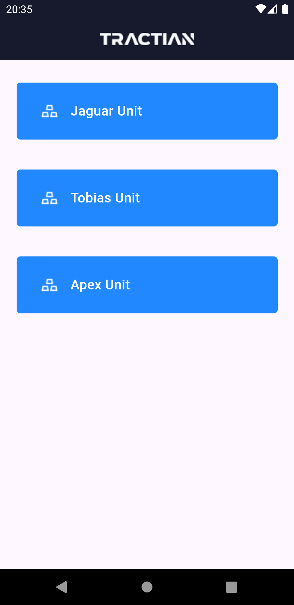
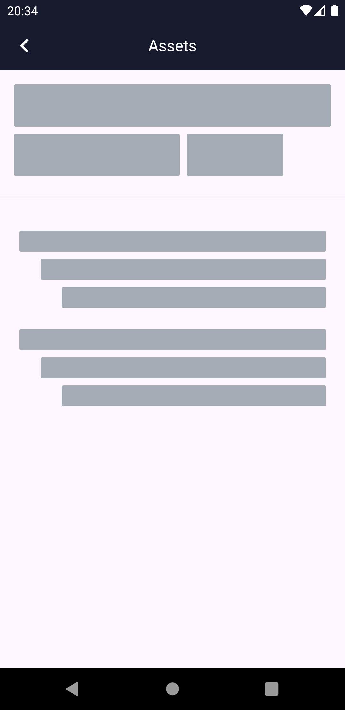
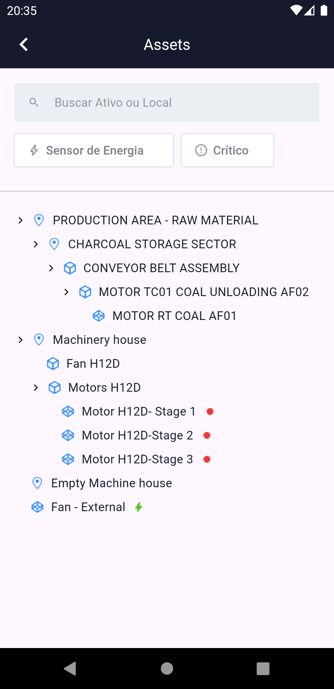

<h1 align="center">Tractian Challenge</h1>
<p align="center">
  
  
  
  
</p>


# :iphone: About the Project

<p>
  Este app faz parte do desafio técnico da Tractian. Tendo como principais funcionalidades:

  - Listagem de Empresas;
  - Visualização dos Assets em Árvore; e,
  - Filtro por nome, status e sensor.
  
  O app foi projetado seguindo o Clean Arquitecture, com a divisão de camadas em: Data, Domain, and Presentation.
  
</p>


# :camera: Screenshots
<div align="center">
   
   
   
</div>


## :rocket: Packages

- [Flutter bloc](https://pub.dev/packages/flutter_bloc)
- [Bloc](https://pub.dev/packages/bloc)
- [Equatable](https://pub.dev/packages/equatable)
- [GetIt](https://pub.dev/packages/get_it)
- [DartZ](https://pub.dev/packages/dartz)


## :computer: How to run

```bash
# Clone Repositorio
$ git clone https://github.com/WallaceHolanda/tractian_challenge.git

# Instale as dependências
$ flutter pub get

# Rode a aplicação
$ flutter run
```

## :page_facing_up: Licence

This project is under the [MIT License](./LICENSE)

Made by Wallace Holanda.
